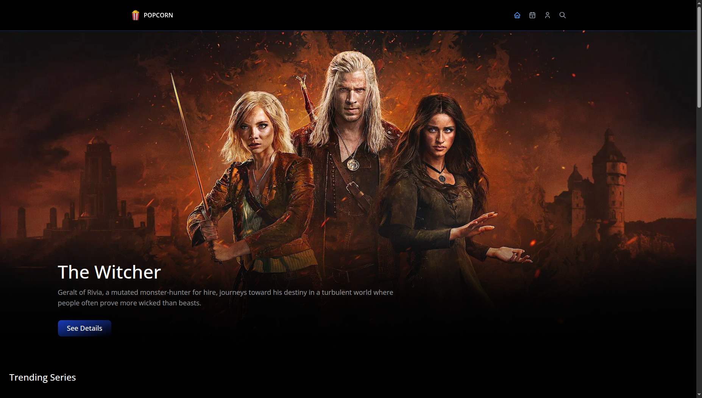

# 🎬 Popcorn — Movie Discovery App

Popcorn is a modern movie discovery web app built using **React**, **TypeScript**, and **TMDB API**.  
It lets users explore trending movies, view details, watch trailers, and bookmark favorites — all in a sleek, responsive UI powered by **Tailwind CSS** and **shadcn/ui** components.


## ScreenShot


## 🚀 Features

- 🔥 **Discover Trending Movies & TV Shows** (powered by TMDB API)
- 🎥 **Watch Trailers** directly within the app
- 💾 **Bookmark & Watchlist** your favorite movies
- 📱 **Responsive Design** — optimized for all screen sizes
- ⚡ **React Query** for fast, cached data fetching
- 🎨 **Tailwind + shadcn/ui** for beautiful responsive and  consistent UI
- 🧠 **TypeScript** for strong type safety and maintainable code


## 🛠️ Tech Stack

| Technology | Purpose |
|-------------|----------|
| **React** | Frontend library |
| **TypeScript** | Static typing and safer code |
| **Tailwind CSS** | Utility-first styling |
| **shadcn/ui** | Prebuilt accessible UI components |
| **React Query** | Data fetching and caching |
| **TMDB API** | Movie & TV show data source |
| **Zustand** | used for global state management


## 📂 Folder Structure
```
src/
├── components/ 
├── hooks/
├── lib/
├── pages/
├── routes/
├── stores/
├── types
├── utils/
├── App.tsx
├── index.css
└── main.tsx
```

## ⚙️ Setup Instructions


1. **Clone Repo**

```bash
git clone https://github.com/PATHAKAAKASH19/popcorn.git
cd popcorn
```

2. **Install Dependencies**
```
npm install
 # or
yarn install
```
3. **Create .env file at root and add these env variables**

```
VITE_API_SECRET=your_tmdb_api_Secret_here

VITE_API_KEY=your_tmdb_api_key_here

VITE_BASE_URL="https://api.themoviedb.org/3"

```
4. **Run the app**

```
npm run dev
```

## 📡 API Reference

All data is fetched from The Movie Database (TMDB)
.


## 🧑‍💻 Author

Akash Pathak
[](https://portfolio.akash-pathak.xyz)
 [](https://www.linkedin.com/in/akash-pathak-48026a221/)

##  🪪 License

This project is licensed under the MIT License — feel free to use and modify.